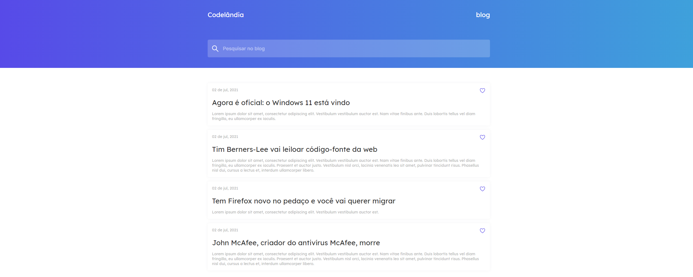

# News Challenger



## 🛠 Tecnologias

- **Front-End**
  - [HTML](https://developer.mozilla.org/pt-BR/docs/Web/HTML)
  - [CSS](https://developer.mozilla.org/pt-BR/docs/Web/CSS)
  - [TypeScript](https://www.typescriptlang.org/)
  - [Vue.js](https://vuejs.org/)
  - [NuxtJS](https://nuxtjs.org/)

## 📐 Layout
O layout utilizado foi desenvolvido pelo [Iuri Code](https://github.com/iuricode) e pode ser encontrado no seguinte arquivo do [Figma](https://www.figma.com/file/Yb9IBH56g7T1hdIyZ3BMNO/Codel%C3%A2ndia-Desafios?node-id=0%3A1).

## 💡 Ajustes e melhorias

O projeto ainda está em desenvolvimento e as próximas atualizações serão voltadas nas seguintes tarefas:

- [ ] Adicionar função para criação de novas notícias.

## 💻 Pré-requisitos

Antes de começar, verifique se você atendeu aos seguintes requisitos:
<!---Estes são apenas requisitos de exemplo. Adicionar, duplicar ou remover conforme necessário--->
* Você instalou a versão mais recente do [Node.js](https://nodejs.org/en/).
* Você instalou a versão mais recente do [Git](https://git-scm.com/).

## ⬇ Instalando o News Challenger

Para instalar o News Challenger, siga estas etapas:

```bash
# Faça o download do projeto para sua máquina, pelo próprio github ou através do terminal utilizando:
$ git clone https://github.com/sovietes/chall-news.git

# Acesse o projeto, no caso do projeto, utilizando:
$ cd chall-news

# Instale as depedências do Node.js
$ npm install
```

## ☕ Usando o News Challenger

Para usar o News Challenger, siga estas etapas:

```bash
# Rode o servidor local através do comando:
$ npm run dev

# Em seguinda acesse o servidor local através do seu navegador, na porta "especificada" pelo output do terminal.
```

## 📂 Estrutura do diretório

```
|-- assets/
  |-- css/
  |-- img/
  |-- img_readme/
|-- components/
|-- pages/
|-- .gitignore
|-- LICENSE.md
|-- nuxt.config.js
|-- package-lock.json
|-- package.json
|-- README.md
|-- tsconfig.json
```

## 🤝 Colaboradores

Agradeceço às seguintes pessoas que contribuíram para este projeto:

<table>
  <tr>
    <td align="center">
      <a href="#">
        <br>
        <sub>
          <b>Iuri Silva</b>
        </sub>
      </a>
    </td>
  </tr>
</table>

## 📝 Licença

Esse projeto está sob licença MIT. Veja o arquivo [LICENÇA](LICENSE.md) para mais detalhes.

[⬆ Voltar ao topo](#chall-news)<br>
